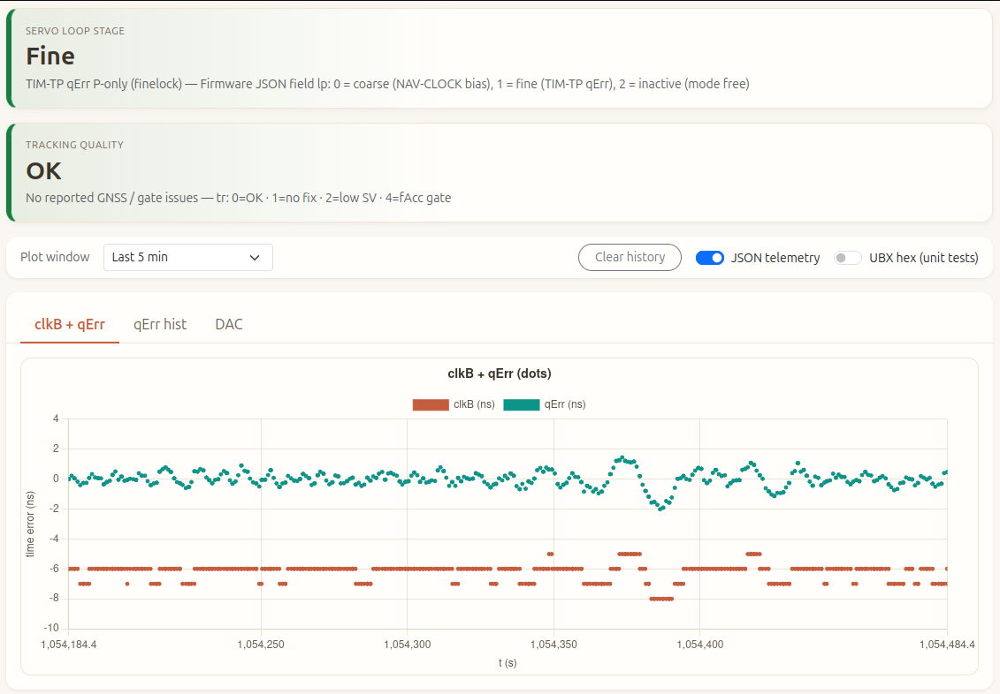

# picoExtRef — GPS-disciplined OCXO reference (Pico)

RP2040 firmware that steers an OCXO via PWM (“DAC”), reads u-blox GNSS time over UART (UBX), and closes a two-stage servo: coarse steering from NAV-CLOCK and fine steering from TIM-TP `qErr`. A small Flask dashboard on the host tails USB CDC for live plots and tuning.

**Hardware upstream:** this tree is based on [gibbi/PicoGPSDO](https://github.com/gibbi/PicoGPSDO) (schematics, KiCad, and notes under `hardware/`). Presentation context: European GNU Radio Days 2024 — [talk on YouTube](https://www.youtube.com/watch?v=h3X4QuF_BUM).

---

## Web UI screenshot



## Repository layout and components

| Area | Role |
|------|------|
| **`src/main.c`** | Boot, PWM DAC / 26 MHz ref clock, main loop, JSON telemetry, USB CLI polling, fine-mode edge tracker integration, fractional DAC accumulation. |
| **`src/ubx.c`**, **`src/ubx_rx.c`** | UART RX (frame assembly + checksum), UBX decode, fills `current_gps_data` (NAV-CLOCK, TIM-TP, PVT, etc.). |
| **`include/ubx_clean.h`** | Shared GPS/UBX structs and packet layout used by the parser. |
| **`src/gpsdo_control.c`**, **`include/gpsdo_control.h`** | Finelock hysteresis, coarse/fine control outputs (`u_ns`), NAV-CLOCK bias handling, telemetry `tr` flags. |
| **`src/gpsdo_tune.c`**, **`include/gpsdo_tune.h`** | Runtime tunables and USB one-line CLI (`kp`, `fine_mode`, gates, etc.). |
| **`include/display.h`** | SSD1306 OLED over I2C (optional); live status text on the module. |
| **`pico_gpsdo_web.py`** | Flask host app: reads Pico USB serial, parses `{…}` telemetry, serves charts, tune forms, log tail, optional series clear. |
| **`pico.py`** | Developer entrypoint: `clean` / `build` / `flash` / `webserver` / `lint` (see script header for caveats on `build/` paths). |
| **`CMakeLists.txt`**, **`boards/`** | Pico SDK project, board hooks. |
| **`hardware/`** | From [PicoGPSDO](https://github.com/gibbi/PicoGPSDO): PCB and hardware documentation (see `hardware/Readme.md`). |
| **`tests/`** | Small host-side tests (e.g. UBX RX framing). |

---

## Data flow (short)

1. **u-blox** → UART0 → UBX frames → `current_gps_data` (`clkB`, `qErr`, `dac`, fix, etc.).
2. **Servo** (when `mode servo`): coarse on `clkD_bias` when bias steps; fine on `qErr` (P-only or edge mode) in finelock.
3. **USB CDC** → compact JSON lines for the host **web UI** and `printf` debugging.

---

## Quick start

```bash
# Firmware (needs Pico SDK in environment per Pico docs)
./pico.py build
./pico.py flash          # optional: ./pico.py flash --webserver

# Web dashboard only (USB serial to the Pico)
pip install -r requirements.txt
./pico.py webserver      # or: python3 pico_gpsdo_web.py … per pico.py usage
```
